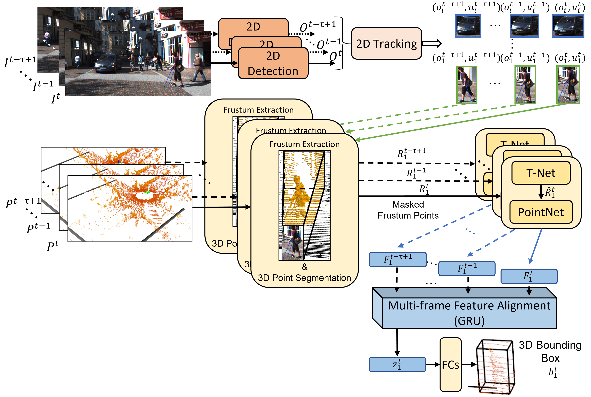

* [Usage](#usage)
* [Architecture](#architecture)
* [Docker](#docker)
* Detection on KITTI Dataset
   * [3D Detection with KITTI Tracking Dataset](#3d-tracking)
   * [KITTI Detection vs Tracking Conversion](#detection-tracking)
* [Results on mmdetection3D](#mmdetection3d)
   

## <a name="usage"></a>Usage
This is the repository of "3D Object Detection with Multi-Frame RGB-Lidar Feature Alignment" study. The evaluation of the code is done on [KITTI Tracking Dataset](#3d-tracking).

The installation requirements are pointed in the [Docker](#docker) section and the provided docker image can be used to run all the codes. 

## <a name="architecture"></a>Architecture

<table>
    <tr><td>

    </td></tr>
</table>


## <a name="docker"></a>Docker
The provided docker image is based on Tensorflow 1.15.2 version given with the docker hub tag "tensorflow/tensorflow:1.15.2-gpu-py3", which supports gpu usage. The "docker/Dockerfile" text file indicates the installation of [Tensorflow Object Detection API](https://github.com/tensorflow/models/tree/master/research/object_detection), OpenCV, and required python libraries defined in "docker/requirements.txt" file. The image built can be pulled from Docker Hub as shown below.

```bash
docker pull emecercelik/tum-i06-object_detection:faster_frustum_nonroot_v3
``` 
The docker image can be run with the dataset-related volume mounts as shown in "run_docker.sh" file. This mounting example is compatible with the example shell scripts given in the sections below for running architecture. 

## <a name="2d-tracking"></a>2D Detection with KITTI Tracking Dataset
The training pipeline for 2D detection and tracking pipeline uses Tensorflow Object Detection (TF OD) API's pipeline. Therefore, please refer to the README.md file in detection_2d folder for 2D detection and tracking with KITTI. Downloading KITTI dataset is the same as explanation below.  

<ol>
<li> Download dataset </li>

The KITTI Multi-object Tracking Dataset (Tracking dataset) can be downloaded using the links in the official [website](http://www.cvlibs.net/datasets/kitti/eval_tracking.php) of KITTI. To use with this Faster RCNN module, the [left color images](http://www.cvlibs.net/download.php?file=data_tracking_image_2.zip) and [training labels](http://www.cvlibs.net/download.php?file=data_tracking_label_2.zip) should be downloaded.

Downloaded zip files should be extracted in the same root_dir to have the following path order (0000,0001,... are drive indices and 000000,000001,... are frame indices):

```
root_dir
	data_tracking_image_2
		training
			image_02
				0000
					000000.png
					...
				0001
					000000.png
					...
				...
		testing
			image_02
				...
	data_tracking_label_2
		training
			label_02
				0000.txt
				0001.txt
				...
```

<li>Generating rgb_detection file</li>
To test Temp-Frustum Net on data without ground-truths, the rgb_detection.txt files should be prepared, which contains predicted 2D bounding boxes to generate frustum pickle file that is consumed by Temp-Frustum Net test. For detailed explanation of generating rgb_detection files, please check [this item](#3d-tracking). 

</ol>


## <a name="3d-tracking"></a>3D Detection with KITTI Tracking Dataset
<ol>
<li>Download dataset</li>
The KITTI Multi-object Tracking Dataset (Tracking dataset) can be downloaded using the links in the official [website](http://www.cvlibs.net/datasets/kitti/eval_tracking.php) of KITTI. To use with the extended Frustum PointNets module, the [left color images](http://www.cvlibs.net/download.php?file=data_tracking_image_2.zip), [Velodyne point clouds](http://www.cvlibs.net/download.php?file=data_tracking_velodyne.zip), [camera calibration matrices](http://www.cvlibs.net/download.php?file=data_tracking_calib.zip), and [training labels](http://www.cvlibs.net/download.php?file=data_tracking_label_2.zip) should be downloaded.

Downloaded zip files should be extracted in the same root_dir to have the following path order (0000,0001,... are drive indices and 000000,000001,... are frame indices):

```
root_dir
	data_tracking_image_2
		training
			image_02
				0000
					000000.png
					...
				0001
					000000.png
					...
				...
		testing
			image_02
				...
	data_tracking_label_2
		training
			label_02
				0000.txt
				0001.txt
				...
	data_tracking_velodyne
		training
			velodyne
				0000
					000000.bin
					...
				0001
					000000.bin
					...
				...
		testing
			velodyne
				...
	data_tracking_calib
		training
			calib
				0000.txt
				0001.txt
				...
		testing
			calib
				...
		
```
<li>Prepare training data</li>
Since Frustum PointNet uses the points extracted from the frustum of a 2D bounding box, these points should be prepared before training. To prepare .pickle data that is used during training from KITTI tracking dataset, the script shell seen below can be run. The flags used in the script should be adjusted according to the needs, which are explained in the file itself. 

```bash
./frustum-pointnets/kitti/prepare_data_tracking.sh
```

This code will generate "frustum_carpedcyc_tracking_train.pickle" and "frustum_carpedcyc_tracking_val.pickle" files if the name is kept same in the script. 

The frustum-pointnests/kitti/reverse_drives.sh can generate the reversed sequence with a new drive ID to serve as an augmentation in the training. 

The frustum-pointnests/kitti/combine_drive_labels.sh will generate a new drive out of the given drives to combine the labels of them all as one sequence. This is only for labels to be used during evaluation.


<li>Train network</li>
Run the script seen below to train the Frustum PointNet on the KITTI tracking data. The layers for temporal data processing can be selected in the bash script. The flags are explained in frustum-pointnets/scripts/README. 

```bash
./frustum-pointnets/scripts/tracking_train_v1.sh
```
The tracking module will directly utilize the prepared pickle files with the names given in the previous bullet point. These files will be used for training and validation. The training outputs, which are logs and trained model parameters, are saved in the log directory that is defined with the flag (--log_dir) in the bash file.
<li>Validate network</li>
Validation of the network is done during the training and results can be seen in the log file. The validation data can be also used for inference with the trained network to have Average Precision metrics calculated.

<li>Inference</li>
The following bash file can be run for inference. The meaning of flags are explained in the bash file. The test_tracking.sh script generates detection results in KITTI format under the log_path/detection_results/data/"drive_id"/data directory. These results are *.txt files with the names of images. The generated detection results can be used for calculating metrics and visualization of detections.

```bash
./frustum-pointnets/scripts/test_tracking.sh
```
To conduct inference on the validation data, which has ground-truth labels, the --from_rgb_detection flag should be removed and the paths to the trained network and to the validation pickle file should be provided. This is necessary to calculate metrics (Average precision values) on the detections of the trained network. 

To run the inference with data that don't have ground-truth labels, the pickle file for the inference data should be prepared. In this part, the frustums (LiDAR points corresponding to 2D bounding box) are extracted using predicted 2D bounding boxes, which are provided by Faster RCNN as an output. This step can be done running the following bash script with --rgb_detection_path flag set accordingly. 

```bash
./frustum-pointnets/kitti/prepare_data_tracking.sh
```

The meaning of flags and how to use them are explained in the script itself. This script will generate a pickle file with the name of "frustum_carpedcyc_tracking_val_rgb_detection.pickle". test_tracking.sh script can be updated with the name of this pickle file and the inference can be run by running the test_tracking.sh bash script as shown above.

<li>Calculate metrics</li>
To calculate average precision metrics on the trained networks, run the bash script below with the ground-truth path and detection path entered inside. 

```bash
./frustum-pointnets/kitti/eval_tracking.sh
```
Detection path shows the folder, inside which there is a data folder with the detections of each frame as shown below. 000000.txt, 000001.txt shows the frame id and the txt file contains detections in KITTI format.

```
root_dir
	data
		000000.txt
		000001.txt
		...
```
Ground-truth path contains the ground-truth labels of frames in a drive in a separate folder as can be seen below. The path used in the script is therefore root_dir/0011 for the example below.

```
root_dir
	0011
		000000.txt
		000001.txt
		...
```
Indices of txt files in the detection folder and in the ground-truth folder should match each other to have a correct evaluation. For the KITTI tracking dataset, ground-truth labels are not provided in this format. Therefore, the script below can be used to convert tracking ground-truth labels into KITTI object detection format. Before running, the flags inside should be set accordingly and explanation of the flags are provided in the script itself.

```bash
./frustum-pointnets/scripts/tracking2object.sh
```
eval_tracking.sh script provides results under the detection path by generating a folder named as plot. Inside this folder precision-recall curves and AP values can be seen. <class name>_detection.txt corresponds to BEV detection results and at the last line of the txt file AP results can be seen for easy, moderate, and hard difficulty levels of KITTI tracking. <class name>_detection_3d.txt corresponds to 3D detection results and similarly AP results can be seen at the last line of the txt file. Additionally summary.txt provides the summary of results for that drive for all types.

<li>Training & Evaluation </li>
Training, validation, and evaluation can be done via a single script. Please see the following script for details: 

```bash
./frustum-pointnets/scripts/search_parameter.sh
```
This script makes use of /frustum-pointnets/train/train.py and /frustum-pointnets/scripts/run_all_logs.py. run_all_logs.py reads the training parameters from the given log folder and initializes the test automatically. Also, it can run the test (evaluation) with all the checkpoint files in the log folder (e.g. log_time_s1). Please consider using this instead of separately running train and test scripts.  

The /frustum-pointnets/scripts/model_sum.sh summarizes the results from all the checkpoints in a readable format as well as dumps it to npy format. This can be used to find the best results in a parameter search. The training during the parameter search will generate several log folders, which might be named as "log_time_s0, log_time_s1, ...". These files can be run with different parameter sets. model_sum.sh, which uses model_sum.py, groups these log folders according to the given parameters (such as fusion network type and tau). After grouping, this script finds the best resulting parameter set (and its log folder), calculates the mean and variances for all the given drives. Note that the randomness comes from the random initialization of the weights as well as uniform sampling of the points in a frustum. Therefore, it is suggested to run at least 10 times with a parameter set to obtain consistent results. 

Note: Drive 98 is a combination of all validation drives (11,15,16,18). These are combined to have a complete validation score.  

repeat_tracking.sh, as well as repeat_train.py, can be used to repeat the previously done trainings with the same parameter set and settings. Keep in mind that the repeat_train.py will use the *.py files (train.py, frustum_pointnet_v1.py, ...) saved in the log folder instead of the ones already in the main directory (frustum-pointnets/train/*). 

get_all_summaries.sh can be used to have summarized results in an excel file. 

<li>Generating pickle from predictions</li>
After predicting 2D bounding boxes using the README in detection_2d folder, the pickle files with frustum point cloud of the respective bounding boxes can be generated by following the steps below:

`./frustum_framework/detection_2d/train/inference.sh` file generates predictions in the form of KITTI Tracking Dataset: 0011.txt, 0015.txt, etc. The 3D shape values of each line are filled in with dummy numbers. `./frustum_framework/frustum-pointnets/kitti/tracking2rgb_detection.sh` script creates rgb_detection files, which can be consumed by data preparation scripts, out of predictions. After creating rgb_detection.txt files for each drive, the `./frustum_framework/frustum-pointnets/kitti/prepare_data_tracking.sh` script can be used with gen_val_rgb_detection and gen_tracking_val arguments set. This will generate the pickle file with the given name. The generated pickle file can be passed to the `/frustum_framework/frustum-pointnets/scripts/run_all_logs.py` python code to obtain results for the 2D detections.

```bash
# tracking_path: should contain the predictions in the following folder format: <drive_id>/track_labels/<drive_id>.txt Ex: /root_2d_log/validation/pretrained_kitti/0011/track_labels/0011.txt
# drive_ids : Drive IDs to generate rgb_detection files from. 
# rgb_det_path: Folder where the rgb_detection.txt files for each drive will be generated. Ex: <rgb_det_path>/0011/rgb_detection.txt

python tracking2rgb_detections.py 	--tracking_path /root_2d_log/validation/pretrained_kitti/ \
					--drive_ids 11 15 16 18 \
					--rgb_det_path /root_2d_log/rgb_detections_from_predictions/pretrained_kitti/

```

```bash

python prepare_data.py --gen_tracking_val \
			--gen_val_rgb_detection \
			--video_val 11 15 16 18\
			--tracking_path '/kitti_root_tracking'\
			--perturb2d \
			--name_train '_kitti_pred' \
			--name_val '_kitti_pred' \
			--rgb_detection_path /root_2d_log/rgb_detections_from_predictions/pretrained_kitti

```

```bash
LOG_PATH=/root_3d_log/kitti_car_best_repeat/log_time_s31
python run_all_logs.py --log_dir $LOG_PATH --gt_root_dir /kitti_root_tracking/drives_in_kitti --multi_model --parallel --pickle_name frustum_carpedcyc_tracking_kitti_pred_rgb_detection.pickle
```

<li>Visualization</li>
After generating detection results, txt files, as explained in Inference section, the 3D detections can be visualized on image plane. For this the script below can be run. The flags are explained in the script file itself. This script generates a folder with the name of provided KITTI tracking drives and saves the images under that folder with the 3D bounding boxes drawn (save_path/0001/000000.png, 0000001.png, ...).

```bash
./visualization_of_frustum/visualize2d_tracking.sh
```
</ol>

## <a name='detection-tracking'></a>KITTI Detection vs Tracking Conversion
KITTI detection dataset and KITTI tracking dataset have different file formats even though their object definitions are similar. KITTI detection dataset provides calibration and labels per frame, whereas KITTI tracking dataset contains them per drive. Also all the images and velodyne scans are in a folder named with a drive in KITTI tracking dataset. Therefore, these should be converted for some cases. 

<ol>
<li>Label conversion</li>
The tracking2object.py script converts the label format of KITTI tracking to KITTI detection. The script file below can be used as an example. 

```bash
./frustum_framework/frustum-pointnets/kitti/tracking2object.sh
```

Labels in tracking format:
```latex
KITTI
|---data_tracking_label_2
    |---training
        |---label_02
            |---0000.txt
            |---0001.txt
            |---<drive_id>.txt
```

Labels in detection format:
```latex
KITTI
|---data_object_label_2
    |---training
        |---label_2
            |---000000.txt
            |---000001.txt
            |---<frame_id>.txt
```
This script converts the labels of tracking format into detection format, but inside each drive. The output will look like the following:
```latex
output_path
|---0000
    |---000000.txt
    |---000001.txt
    |---<frame_id>.txt
|---0001
    |---000000.txt
    |---000001.txt
    |---<frame_id>.txt
|---<drive_id>
```
If it is necessary to combine these labels into one folder. Please check the following subsection. 

<li>Combining drives</li>
The conversion from tracking to detection format is done per-drive basis. It might be also necessary to combine the labels in one folder for evaluation of all drives at once. The /frustum_framework/frustum-pointnets/train/test_tracks.py script writes the inference results in individual drive folders as well as a combined folder named with drive 98. Therefore, the labels for calculating mAP on the folder 0098 can be created using the following script:

```bash
./frustum_framework/frustum-pointnets/kitti/combine_drive_labels.sh
```

It is not possible to change the name of drive 0098 during inference using arguments yet, but it can be changed by hand in the code (line 340). The /frustum_framework/frustum-pointnets/scripts/run_all_logs.py script will take care of evaluation on drives that are in its gt_root_dir argument. run_all_logs.py will call test_tracks.py, which will generate predicted labels on the drives (in folders 0011,0015,0016,0018 used for validation of Temp-Frustum Net) given in the pickle file used for inference as well as creating predictions in a merged drive folder with the name of 0098. run_all_logs.py will also call evaluation scripts to calculate mAP using ground-truths. Therefore, run_all_logs.py will check its gt_root_dir to see which of the predicted drives has ground-truths in the gt_root_dir and calculate mAP only for those. If the combined ground-truth labels generated with combine_drive_labels.sh are already in gt_root_dir, the evaluation metrics will be calculated among all validation drives. 

<li>Moving Tracking to Detection Format</li>
It might be also necessary to move whole tracking dataset into the detection format. In this case, the following script can be used:

```bash
./frustum_framework/frustum-pointnets/kitti/move_tracking2detection.sh
```

This script will combine images, velodyne scans, labels, and calibs of all the given drives in KITTI Tracking dataset and create a new folder out of them in KITTI Detection dataset format in the following order:
```latex
KITTI
|---output_path
    |---calib
        |---000000.txt
        |---000001.txt
        |---<frame_id>.txt
    |---image_2
        |---000000.txt
        |---000001.txt
        |---<frame_id>.txt
    |---label_2
        |---000000.txt
        |---000001.txt
        |---<frame_id>.txt
    |---velodyne
        |---000000.txt
        |---000001.txt
        |---<frame_id>.txt
    |---train.txt
    |---trainval.txt
    |---val.txt
    |---test.txt
```

*.txt files contain the frame IDs that indicate the train-val splits as well as the test split. For that training_drives and validation_drives tags as well as the split tag should be set as defined in the move_tracking2detection.sh file. 

</ol>


## <a name="mmdetection3d"></a>Results on mmdetection3D library
For comparison, we obtained 3D detection results on KITTI Tracking dataset with the PointPillars and SECOND methods given in the [model zoo](https://github.com/open-mmlab/mmdetection3d/blob/master/docs/model_zoo.md) of [mmdetection3D](https://github.com/open-mmlab/mmdetection3d) library. To accomplish that we needed to go through a few steps given below:
<ol>
<li>Get Docker Image</li>
After cloning the [mmdetection3D](https://github.com/open-mmlab/mmdetection3d) repository, the Dockerfile can be prepared as explained in its [installation](https://github.com/open-mmlab/mmdetection3d/blob/f7356f4baf1393d1c73dfbdd05944b925247b85e/docs/getting_started.md#another-option-docker-image) page. Alternatively, we prepared a docker image which can be pulled as seen below:

```bash
docker pull emecercelik/tum-i06-object_detection:mmdetection3d
```
The data should be mounted to the right directory on the container or the configs should be changed accordingly. 

<li>Convert KITTI Tracking Data into KITTI Detection Data Format</li>
As defined in mmdetection3D [data preparation pages](https://mmdetection3d.readthedocs.io/en/latest/data_preparation.html), the KITTI dataset should be in a certain format. Therefore, we first convert the KITTI Tracking Dataset format into KITTI 3D Detection format using the following script:

```bash
./frustum_framework/frustum-pointnets/kitti/move_tracking2detection.sh
```
The parameters for conversion are explained in the script file itself. 

<li>Adjust mmdetection3D config files</li>
For SECOND and PointPillars models, we adjusted the provided base config files as can be seen under `/frustum_framework/mmdetection3d/configs`. The adjustments are:
* Number of samples per GPU
* Root data directories
* Anchor object sizes (We changed the default values with the values we used for Temp-Frustum Net.)
* Learning rate (Considering the batch size suggested in [mmdetection3D notes](https://mmdetection3d.readthedocs.io/en/latest/1_exist_data_model.html#train-predefined-models-on-standard-datasets) )

Move the adjusted config files to the respective folders under `/mmdetection3d/configs` folder. The structure in the `/frustum_framework/mmdetection3d/configs` are kept the same as the structure in the `/mmdetection3d/configs` folder. 

<li>Prepare data</li>

The KITTI data should be prepared before the training to generated necessary info files and reduced velodyne points. The `/mmdetection3d/tools/create_data.py` script can be run as following:

```bash
ROOT_PATH=/mmdetection3d/data/kitti/detection_format/ # Data root path
OUT_DIR=/mmdetection3d/data/kitti/detection_format/ # Path where the prepared data will be saved.
EXTRA_TAG=kitti_tracking # The postfix for the created info files
python create_data.py kitti --root-path $ROOT_PATH --out-dir $OUT_DIR --extra-tag $EXTRA_TAG
```

<li>Train network</li>
Training can be done on a [single GPU](https://mmdetection3d.readthedocs.io/en/latest/1_exist_data_model.html#train-with-a-single-gpu) or on [multiple GPUs](https://mmdetection3d.readthedocs.io/en/latest/1_exist_data_model.html#train-with-multiple-gpus) following the mmdetection3d documentation. Necessary arguments should be passed to the train script with the correct config file. An example can be seen below:

```bash
# SECOND
WORK_DIR=/mmdetection3d/data/kitti/detection_format/work_dirs/second_v2
NUM_GPU=1
CONFIG_FILE_PATH=/mmdet_host/configs/second/hv_second_secfpn_2x4_80e_kitti_tracking-3d-3class.py
./tools/dist_train.sh $CONFIG_FILE_PATH $NUM_GPU --work-dir $WORK_DIR

# PointPillars
CONFIG_FILE_PATH=/mmdet_host/configs/pointpillars/hv_pointpillars_secfpn_6x2_160e_kitti_tracking-3d-3class.py
WORK_DIR=/mmdetection3d/data/kitti/detection_format/work_dirs/pointpillars_v1
NUM_GPU=1
./tools/dist_train.sh $CONFIG_FILE_PATH $NUM_GPU --work-dir $WORK_DIR

# PartA2
CONFIG_FILE_PATH=/mmdet_host/configs/parta2/hv_PartA2_secfpn_2x1_cyclic_80e_kitti_tracking-3d-3class.py
WORK_DIR=/mmdetection3d/data/kitti/detection_format/work_dirs/parta2_v1
NUM_GPU=2
./tools/dist_train.sh $CONFIG_FILE_PATH $NUM_GPU --work-dir $WORK_DIR

#MVXNet
CONFIG_FILE_PATH=/mmdet_host/configs/mvxnet/dv_mvx-fpn_second_secfpn_adamw_2x2_80e_kitti_tracking-3d-3class.py
WORK_DIR=/mmdetection3d/data/kitti/detection_format/work_dirs/mvxnet_v1
NUM_GPU=2
./tools/dist_train.sh $CONFIG_FILE_PATH $NUM_GPU --work-dir $WORK_DIR
```

<li>Run inference script</li>
The test script can be run with the respective config files to generate detection results on the prepared data according to the [mmdetection3d documentation](https://mmdetection3d.readthedocs.io/en/latest/1_exist_data_model.html#test-existing-models-on-standard-datasets). One example can be seen below. 

```bash
cd /mmdetection3d
CONFIG_FILE=/mmdet_host/configs/second/hv_second_secfpn_2x4_80e_kitti_tracking-3d-3class.py
GPU_NUM=1
RESULT_FILE=/mmdetection3d/data/kitti/detection_format/results/second_tracking_results3.pkl
CHECKPOINT_FILE=/mmdetection3d/data/kitti/detection_format/work_dirs/hv_second_secfpn_2x4_80e_kitti_tracking-3d-3class/epoch_40.pth
./tools/dist_test.sh $CONFIG_FILE $CHECKPOINT_FILE $GPU_NUM --out $RESULT_FILE --eval mAP
```

The outputs are saved as pickle (*.pkl) files and can be read using `numpy.load` function. The detection results will be evaluated with the indicated metric (`--eval mAP`) passed to the test script. Also results can be converted into KITTI 3D Detection dataset format, which are txt files named with the frame index. The `results2kitti.py` python file should be copied under `/mmdetection3d/tools/data_converter` and the `results2kitti.sh` script should be copied under `/mmdetection3d/tools/`. Afterwards, the script can be run as following:

```bash
cd /mmdetection3d
./tools/results2kitti.sh
```

<li>Run evaluation script in this repository to obtain results</li>
The detection results can be also evaluated using the evaluation code inside the `frustum_framework` in its docker container in addition to mmdetection3d's evaluation methods. To do so, run the following script in the docker container `faster_frustum_nonroot_v3`.

```bash
# DET_PATH should contain the prediction txt files under a folder named 'data'
./frustum_framework/frustum-pointnets/train/kitti_eval/evaluate_object_3d_offline $GT_PATH $DET_PATH
```

</ol>


